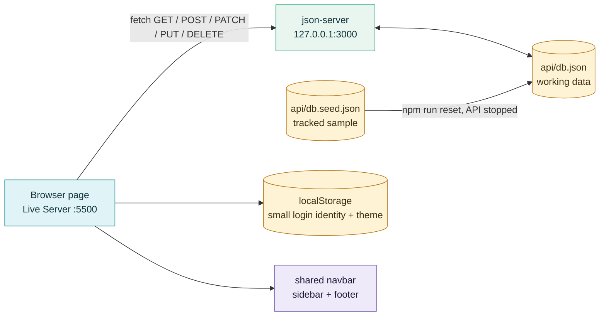
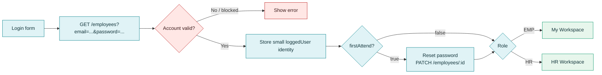

# Connectra · HR portal

A local, educational HR web app built with **HTML, CSS, browser JavaScript, and `json-server`**. Employees can manage their work and requests; HR can manage employees, tasks, policies, feedback, leave, and helpdesk tickets. The app uses one JSON-backed API for its active data.

Figma Link: https://www.figma.com/design/3zWfidyuAT7SUeZR03IaJ2/Orange_Design_Task?node-id=64-36&t=dMtOE5IXhZKPGrVE-1

Trello Link: https://trello.com/invite/b/6abc18a6e1214e8657b68f60/ATTIae9606e3158abd68c8048355bc2404b82C5533FC/hr-management-system-project-🧩

> [!IMPORTANT]
> Run **two servers**: one for the web pages (for example, VS Code Live Server on port 5500) and one for the JSON API (`npm run api` on port 3000). Opening an HTML file directly will break shared components and API flows.

**Reading key:** 🟦 Employee flow · 🟩 HR flow · 🟨 Shared/public flow · 🟥 Changes data · 🧪 Testing/help

## Contents

- [Start the app](#start-the-app)
- [How the pieces fit together](#how-the-pieces-fit-together)
- [Where data lives](#where-data-lives)
- [Screen and folder map](#screen-and-folder-map)
- [Shared navigation, sidebars, footers, and theme](#shared-navigation-sidebars-footers-and-theme)
- [1. Sign in, first login, and sign out](#1-sign-in-first-login-and-sign-out)
- [2. Profile and employee details](#2-profile-and-employee-details)
- [3. Employee workspace and tasks](#3-employee-workspace-and-tasks)
- [4. Leave and time off](#4-leave-and-time-off)
- [5. Helpdesk and meetings](#5-helpdesk-and-meetings)
- [6. Feedback](#6-feedback)
- [7. Policies](#7-policies)
- [8. HR workspace and employee directory](#8-hr-workspace-and-employee-directory)
- [9. HR task management](#9-hr-task-management)
- [API reference](#api-reference)
- [Testing and troubleshooting](#testing-and-troubleshooting)
- [Team workflow and project limits](#team-workflow-and-project-limits)

## Start the app

### First time on this computer

1. Install **Node.js and npm**. Check them with `node --version` and `npm --version`.
2. Open a terminal in **this exact `Project-1` folder**. Use `pwd` (macOS/Linux) or `cd` (Windows) to check the path; running the API from a different clone reads a different database.
3. Install the local API dependency and create your writable database:

   ```bash
   npm install
   npm run reset
   ```

4. Start the API and leave this terminal open:

   ```bash
   npm run api
   ```

5. In VS Code, open [Login](common/login/login.html) with **Open with Live Server**. Live Server usually serves the pages on `http://127.0.0.1:5500`; the API stays at `http://127.0.0.1:3000`.

> [!CAUTION]
> `npm run reset` replaces your working `api/db.json` with the sample `api/db.seed.json`. Run it for initial setup, or only when you intentionally want fresh sample data. Stop the API with **Ctrl+C** first. The reset script refuses to run while port 3000 is active and backs up the previous database as `api/db.backup-*.json`.

### Every later session

Run `npm run api` from the same project folder, keep it open, and open the Login page through Live Server. You do **not** need to reset the database each time.

| Demo role | Email | Password | Landing page |
| --- | --- | --- | --- |
| 🟩 HR | `hr@company.com` | `hrPassword123` | [HR Workspace](hr/workspace/workspace.html) |
| 🟦 Employee | `lana@company.com` | `empPassword123` | [My Workspace](employee/MyWOrkSpace/MyWOrkSpace.html) |

These are sample accounts in `api/db.seed.json`. The Login page clears an older local session when opened. A blocked account cannot sign in. HR and employee pages redirect visitors without the matching role.

## How the pieces fit together



A page's `.html` builds the interface, its `.css` styles it, and its `.js` fetches or updates data. `json-server` reads the JSON database and exposes REST endpoints. A `fetch()` failure usually means the API is stopped, on another port, or running from the wrong checkout.

**One computer is not a shared deployment.** `127.0.0.1` means *this computer*. Teammates who clone the repository get the same tracked sample database after reset, but each person's later edits stay on their own machine. A truly shared, 24/7 database requires hosting an API and persistent storage; this README describes the local classroom setup.

## Where data lives

| Place | Purpose | In Git? | What changes it? |
| --- | --- | --- | --- |
| `api/db.seed.json` | Starting sample for all collections | ✅ Yes | Deliberate project edits/commits |
| `api/db.json` | The current local working database | ❌ No | API requests; reset replaces it |
| `api/db.backup-*.json` | Local backup made before a reset | ❌ No | `npm run reset` |
| Browser `localStorage` | `loggedUser` identity and `teamspaceTheme` | No | Login, profile edit, logout, theme toggle |

The browser does **not** store the full employees list. Login keeps the signed-in person's small identity so the navbar and pages know whom to load. The pages then request current records from the API. Editing `api/db.seed.json` does not change a running `api/db.json` until you intentionally reset. Editing `api/db.json` by hand while the API is running can also be overwritten by the server's in-memory data; use an API request or stop the API first.

The active collections are:

| Collection | What it contains | Main readers/writers |
| --- | --- | --- |
| `employees` | Accounts, roles, status, contact details, photos, first-login flag | Login, profiles, HR directory |
| `tasks` | Assigned work, status, due date, attachments | Employee task board, HR tasks, workspaces |
| `leaveBalances` | PTO, sick, floating, and unpaid balances | Employee leave cards, HR approval, HR employee creation |
| `leaveRequests` | Leave and early-departure requests | Employee leave page, HR requests |
| `helpdeskRequests` | Tickets and meeting proposals | Employee/HR helpdesk, workspace agenda |
| `helpdeskDrafts` | One employee's saved helpdesk draft | Employee helpdesk |
| `feedback` | Suggestions/questions and HR review state | Contact page, HR inbox |
| `policies` | Company policy cards | HR policy editor, employee policy reader |

The seed also contains a `requests` array, but the current screens use `leaveRequests` and `helpdeskRequests` for their active request flows.

**IDs:** `employees[].id` is the API record key used for queries such as `/tasks?employeeId=2`. `employees[].employeeId` is a displayed badge such as `EMP-1892`; it is not the same field. The API command includes `--foreignKeySuffix _ref` to prevent `json-server` from mistaking fields ending in `Id` for relationships and deleting unrelated records.

## Screen and folder map

| Area | Pages | What to edit |
| --- | --- | --- |
| 🟨 Public/shared | [Home](common/home/home.html), [Login](common/login/login.html), [Reset Password](common/reset-password/reset-password.html), [Profile](common/profile/profile.html), [Edit Profile](common/edit-profile/edit-profile.html), [About](common/about/about.html), [Team](common/team/team.html), [Contact & Feedback](common/contact/contact.html) | Each screen's `.html`, `.css`, `.js` in `common/` |
| 🟦 Employee | [My Workspace](employee/MyWOrkSpace/MyWOrkSpace.html), [My Details](employee/details/details.html), [My Tasks](employee/my-tasks/my-tasks.html), [Leave & Time Off](employee/Leave&TimeOff/Leave&TimeOff.html), [Helpdesk](employee/helpDesk/helpDesk.html), [Policies](employee/policies/EMPpolicies.html) | Matching folder in `employee/` |
| 🟩 HR | [HR Workspace](hr/workspace/workspace.html), [Employees](hr/employees/employees.html), [Employee Details](hr/employee-details/employee-details.html), [Tasks](hr/tasks/tasks.html), [Leave Requests](hr/requests/requests.html), [Helpdesk](hr/helpdesk/helpdesk.html), [Feedback Inbox](hr/feedback/feedback.html), [Policy Management](hr/policies/policies.html) | Matching folder in `hr/` |
| 🧩 Shared | Navbar, sidebars, footer, theme, meeting helper | `shared/` |
| 🗃️ Data | Seed, reset script, API tests | `api/` |
| 🧭 Guide | [Interactive flow simulator](project-flow-guide/index.html) | `project-flow-guide/` |

[All Screens](index.html) is a developer link list. It does not bypass login or role checks. The Team page has its own six photos in `common/team/team photos/`; the Home page's videos live in `common/home/`.

## Shared navigation, sidebars, footers, and theme

1. **Navbar:** a page includes an empty `<nav data-navbar="hr">` or `<nav data-navbar="employee">`. `shared/navbar.js` loads [HR navbar](shared/navbar-hr.html) or [employee navbar](shared/navbar-employee.html), fills in the signed-in name/photo, and shows Login instead when signed out. Shared `common/` pages use the employee navbar for an employee session. The logo returns to Home; **Workspace** returns to the appropriate role's workspace. On narrow screens, the links move into a hamburger menu.
2. **Role checks:** `shared/navbar.js` redirects a signed-out visitor away from `hr/` or `employee/`; it redirects a signed-in person away from the wrong role's pages. HR may read the employee policy page from the main navbar, while the HR sidebar opens the management page. These are client-side demo checks, **not** server authorization.
3. **Sidebars:** [employee-sidebar.html](shared/employee-sidebar.html) and [hr-sidebar.html](shared/hr-sidebar.html) are injected by their matching `.js` files. They mark the active page and show the user's photo/name. The employee sidebar reads `/tasks?employeeId=...`: active count excludes `completed`, and progress is `completed / all tasks × 100` (0% when there are no tasks).
4. **Footers:** [shared/footer.html](shared/footer.html) is loaded on normal pages by `shared/footer.js`. Home has a **private footer** in `common/home/home.html` with contact details, links, and a small map. The feedback/contact page can show its own map inside the page; it does not replace the shared footer.
5. **Theme:** `shared/theme.css` defines light/dark colors and `shared/navbar.js` saves the switch in `localStorage.teamspaceTheme`. Use CSS variables such as `var(--color-card)` and `var(--color-text)` in page CSS. Some older page-specific styles still use fixed colors, so check each screen visually when changing the palette.

> [!TIP]
> To edit one shared link, change the matching file in `shared/` once. To edit a page's layout, change its own `.css`. Keep shared script/style links in the HTML; the shared pieces need HTTP, so `file://` does not work.

## 1. Sign in, first login, and sign out



1. The form in `common/login/login.html` calls `GET /employees` with the entered email and password. `login.js` checks the returned employee's `status` (`Active` or `Inactive` can continue), and that `role` is `EMP` or `HR`. A blocked account gets an error.
2. On success, it stores only `id`, `role`, `name`, `email`, department, position, badge ID, and photo in `loggedUser`. The whole employee database is **not** copied into localStorage.
3. If `firstAttend` is `true`, Login opens `common/reset-password/reset-password.html`. That page validates at least eight characters with letters and numbers, then `PATCH`es the new password and `firstAttend: false` to `/employees/:id`.
4. Otherwise HR opens `hr/workspace/workspace.html`; an employee opens `employee/MyWOrkSpace/MyWOrkSpace.html`. The shared navbar selects the right links and guards role-specific paths.
5. Logout removes the local identity and returns to Login. Opening Login also clears an older local session. The theme setting remains.

**Example request:** `GET http://127.0.0.1:3000/employees?email=lana%40company.com&password=empPassword123` returns matching employee records to the page. This is intentionally simple for a local course demo; it is **not** secure authentication for a real deployment.

## 2. Profile and employee details

| Action | Read/write path | Result |
| --- | --- | --- |
| Open **My Profile** from the navbar | `GET /employees/:id` | Shows current name, role, contact, employment fields, and photo from the API. |
| Open **My Details** (employee sidebar) | `GET /employees/:id` | Shows the employee's current employment information and photo. HR cannot enter this EMP-only page. |
| HR clicks an employee/eye in the directory | `GET /employees/:id` using the URL's `?id=...` | Opens HR's employee-details view for that selected record. |
| Edit your profile | `PATCH /employees/:id` | Saves name, phone, and optional photo; updates the small `loggedUser` identity so navbar/sidebar text stays current. |

`common/edit-profile/edit-profile.js` accepts a nine-digit local phone number (stored with `+962`) and an image under 1 MB. The image is stored as a data URL in the employee JSON record, so large photos can make `db.json` grow quickly. **Cancel** leaves without saving. Fields such as salary, ID, and join date are displayed in details but are not changed through the self-edit form.

## 3. Employee workspace and tasks

1. [My Workspace](employee/MyWOrkSpace/MyWOrkSpace.html) greets the signed-in employee. It fetches that person's tasks and helpdesk meetings, shows priority links, and builds the agenda from real approved/scheduled meeting records. Clicking a task opens `my-tasks.html?task=<id>` so the task dialog opens directly. **Request Time Off** links to `Leave&TimeOff.html#request-time-off`, which opens the request form.
2. [My Tasks](employee/my-tasks/my-tasks.html) loads only `GET /tasks?employeeId=<loggedUser.id>`. The board groups tasks by `todo`, `progress`, `review`, and `completed`. Search, category, and priority controls filter the visible board.
3. Opening a task shows its details. The employee can change its board status, attach a PDF of up to 1 MB, and send it for review. Task changes are saved with `PUT /tasks/:id` (the full task object), and the page calls `updateSidebarTasks()` (from `employee-sidebar.js`) so the sidebar recomputes count/progress.
4. HR manages the same `tasks` collection in [HR Tasks](hr/tasks/tasks.html). The employee board and HR board see each other's API changes after they reload/re-fetch.

**Status path:** `todo → progress → review → completed` is the normal reading order. The UI can also move cards as allowed by its controls; a sent task gets `review`, and HR can review/manage it. The sidebar percentage counts only `completed` tasks.

## 4. Leave and time off

| Step | 🟦 Employee page | 🟩 HR page / database |
| --- | --- | --- |
| View balances | Reads `GET /leaveBalances?employeeId=<id>` and shows Annual PTO, Sick Leave, Floating Holiday, and Unpaid Leave. | New HR-created employees receive a starting balance record. Floating-holiday expiry is set to the next March 31. |
| Request time off | Opens a modal, checks type/dates/reason and remaining balance, then `POST /leaveRequests` with `status: "Pending"`. | [HR Requests](hr/requests/requests.html) reads `/leaveRequests` and `/employees` to show the employee name. |
| Early departure | The same modal saves a request with `type: "Early Departure"`, date and time range, and `days: 0`. | HR approves or rejects it like other requests; no day balance is deducted for a zero-day departure. |
| HR decision | The employee sees the saved status after reloading. | `PATCH /leaveRequests/:id` records Approved/Rejected and reviewer. Approval of a day-based leave also `PATCH`es the matching `leaveBalances` used count. |
| Withdraw | The employee can delete their own eligible request through `DELETE /leaveRequests/:id`. | The record disappears from that employee's list; the API must use the safe foreign-key-suffix setting. |
| History | Pending and approved requests stay in upcoming/current through their end date, then move to history the following day. Rejected requests appear in history immediately. Same-day early departures move after their end time. | History is a view of the same `leaveRequests` records, not a second database table. |

For valid `floatingHoliday.expiresOn` values, the card formats the saved date. Missing/invalid dates show **“Expiration date unavailable”** instead of `undefined NaN`. This does not invent an expiry date. The sample balances are in `api/db.seed.json`; current local balances are in `api/db.json`.

## 5. Helpdesk and meetings

1. 🟦 In [Employee Helpdesk](employee/helpDesk/helpDesk.html), the employee chooses a standard ticket or a meeting, fills in category/subject/details, and optionally attaches a file. A draft uses `POST`/`PATCH /helpdeskDrafts`; submitting uses `POST /helpdeskRequests` and removes the saved draft. The page fetches only this employee's tickets.
2. 🟩 In [HR Helpdesk](hr/helpdesk/helpdesk.html), HR reads all tickets and can filter/search, approve, reject with a reason, or propose a new meeting time. These decisions use `PATCH /helpdeskRequests/:id`.
3. A meeting can use **Google Meet** or the **Zoom option**. The uploaded Zoom example in this project is actually a **Jitsi demo**: HR approval of the Zoom option creates/reuses a Jitsi room via `shared/helpdesk-meetings.js`; the Join button opens `common/meetingZoom/index.html`. Google Meet approval instead requires a valid `https://meet.google.com/...` link entered by HR.
4. Either side can propose a reschedule. HR's proposal sets `status: "Reschedule Requested"` and saves `rescheduleRequest`; the employee can accept or propose another time. An accepted/approved proposal updates the meeting's date/time, and the employee workspace agenda reads the resulting meeting record.
5. The employee can view ticket details and withdraw eligible tickets with `DELETE /helpdeskRequests/:id`. Both pages reload their own lists from the API.

The Jitsi demo needs network access to `meet.jit.si`; it is not a real Zoom integration. The local database holds meeting metadata/links, not a hosted video recording.

## 6. Feedback

1. 🟨 [Contact & Feedback](common/contact/contact.html) works for a signed-in user or a guest. It collects category, subject, message, optional attachment, and an anonymous choice. For a signed-in user it fills name/email from `loggedUser`; anonymous submissions hide those fields in the saved feedback record. Submit sends `POST /feedback` with a timestamp, `read: false`, and no initial priority.
2. 🟩 [Feedback Inbox](hr/feedback/feedback.html) fetches `/feedback` newest first. HR can search by author/subject/message, filter by category, sort, download an attached file, set priority, and mark an item reviewed. These changes use `PATCH /feedback/:id`.
3. The HR inbox starts empty in the tracked seed. To see cards, submit feedback from the Contact page while the API is running, then refresh the inbox. The contact page's map appears in its content area; the normal shared footer remains separate.

## 7. Policies

1. 🟩 [HR Policy Management](hr/policies/policies.html) reads `GET /policies`. The seed starts with an empty list, so the page shows **Add the first policy**. HR can `POST /policies` with title/category/description, or edit existing cards and `PATCH /policies/:id`.
2. The HR **Download** button fetches the latest `/policies` again and downloads an HTML policy document. It does not produce a PDF despite an internal element named `pdf`.
3. 🟦 [Employee Policies](employee/policies/EMPpolicies.html) reads the same collection and displays it without editing controls. An HR user can open this read-only view from the top navbar; the HR sidebar opens the editable HR view.

## 8. HR workspace and employee directory

1. [HR Workspace](hr/workspace/workspace.html) reads `GET /employees` to show counts for total, active, first-time-login, and blocked accounts, plus links to HR tools.
2. [Employees Directory](hr/employees/employees.html) reads `GET /employees`. Search covers name, email, and department. Filters cover department, status, and role; the table can sort and paginate. **Export** downloads a CSV of the directory.
3. **Add Employee** opens a form. HR supplies employee data and an initial password; a default password is generated if the field is empty. The new account is saved with `POST /employees`, `firstAttend: true`, and an initial `leaveBalances` record. IDs/join dates are assigned in the creation flow rather than manually edited later. The new employee must reset their password on first login.
4. **Edit Employee** uses `PATCH /employees/:id`. Leaving the password blank keeps the old one; entering a new password sets `firstAttend: true` so it must be changed at next login. **Block/Reactivate** changes `status` through `PATCH`, preserving the record instead of deleting it. HR cannot block their own account through the directory controls.
5. Click the row or eye icon to open [HR Employee Details](hr/employee-details/employee-details.html) for that employee. The page reads the selected `id` from its URL and fetches that record from the API.

## 9. HR task management

[HR Tasks](hr/tasks/tasks.html) loads `GET /tasks` and `GET /employees`. HR can create and assign work, change or review existing work, and use the board's filters and controls. Creation uses `POST /tasks`; edits and status changes use `PATCH /tasks/:id`; deletion uses `DELETE /tasks/:id`. Employee assignment is tied to the API employee ID, which lets the employee's My Tasks screen query only their records. Review is part of this task page; there is no separate `task-review` screen in the current project.

## API reference

All routes below are relative to `http://127.0.0.1:3000`. `json-server` generates the usual REST routes for each array in `api/db.json`.

| HTTP method | Example | Meaning |
| --- | --- | --- |
| `GET` | `/employees/2` or `/tasks?employeeId=2` | Read one record or filter a collection. |
| `POST` | `/feedback` | Create a record. |
| `PATCH` | `/employees/2` | Change only supplied fields. |
| `PUT` | `/tasks/7` | Replace the saved task with the complete object sent by the employee task board. |
| `DELETE` | `/leaveRequests/12` | Remove one record. |

A small `PATCH` body looks like:

```json
{ "status": "Blocked" }
```

Open `http://127.0.0.1:3000/db` in a browser to inspect the API's **current in-memory view** of every collection, or `/employees` for the accounts. Use [api/README.md](api/README.md) for data setup and the historical deletion bug, and [api/TESTING.md](api/TESTING.md) for a beginner's test walkthrough.

## Testing and troubleshooting

```bash
npm run test:api
```

This suite creates **temporary databases and ports**. It checks key CRUD behavior, including the earlier bug where deleting a request also deleted employees. It does not modify your working `api/db.json`. For a visual, read-only walkthrough of each screen's code path, open the [Interactive Flow Simulator](project-flow-guide/index.html) with Live Server.

| Symptom | Check |
| --- | --- |
| Login says “Failed to fetch” or data is blank | Run `npm run api` and open `http://127.0.0.1:3000/employees`. Also check DevTools → Network. |
| Browser says a shared navbar/sidebar/footer is unavailable | Use Live Server, not `file://`. Check that the page loads its shared `.js` file. |
| An HR page redirects to Login or an employee workspace | Sign in with the HR sample in the same browser. Role routing is intentional. |
| An employee page redirects to Login or HR Workspace | Sign in with an employee account. |
| Data looks different from a file you opened | Check the project path where `npm run api` was started. Multiple clones can contain different `api/db.json` files. Stop the old API before starting the intended one. |
| Port 3000 is already in use | Another API may already be running. Stop it; the page code points to `127.0.0.1:3000`. |
| A manual database restore disappears after another write | Stop the API **before** replacing `db.json`; restart it so memory reloads the file. Prefer API edits while it is running. |
| New sample changes do not appear | `db.seed.json` is only the template. Reset deliberately copies it to `db.json` after backing up the old file. |
| A floating-holiday card has no date | Check that the current employee's `leaveBalances[].floatingHoliday.expiresOn` is a valid `YYYY-MM-DD` date. New HR-created balances set the next March 31. |
| Fonts/icons or the Jitsi meeting do not load | Those external resources need internet access. The page and API can still be local. |

> [!CAUTION]
> Do **not** expose this API to the public internet. The demo stores plain-text passwords, and browser-side role redirects are not server-side authorization. Use only sample data for this class project.

## Team workflow and project limits

- Pull the project code from Git, run `npm install` when dependencies change, and create a local `db.json` with `npm run reset` **only if needed**. `node_modules/`, the working database, and reset backups are ignored by Git. A teammate's local API writes do not travel through `git pull`.
- Make code and tracked sample-data changes on a branch, review them, then merge into your team branch. If you want teammates to receive a new *sample* record, change `api/db.seed.json` in Git; they must intentionally reset or migrate their existing working data to use it.
- Keep project paths exact: `employee/MyWOrkSpace`, `employee/Leave&TimeOff`, and `employee/helpDesk` use their current capitalization. URLs such as `?task=7`, `?id=2`, and `#request-time-off` are part of the page-to-page flows.
- The app is an educational local prototype: no real login service, password hashing, persistent shared server, or server-enforced permissions. Before real deployment, those parts need a proper backend and database.

More focused documentation: [shared component guide](shared/README.md) · [employee sidebar guide](shared/EMPLOYEE_SIDEBAR.md) · [API setup](api/README.md) · [API testing](api/TESTING.md) · [interactive flow simulator](project-flow-guide/README.md).
